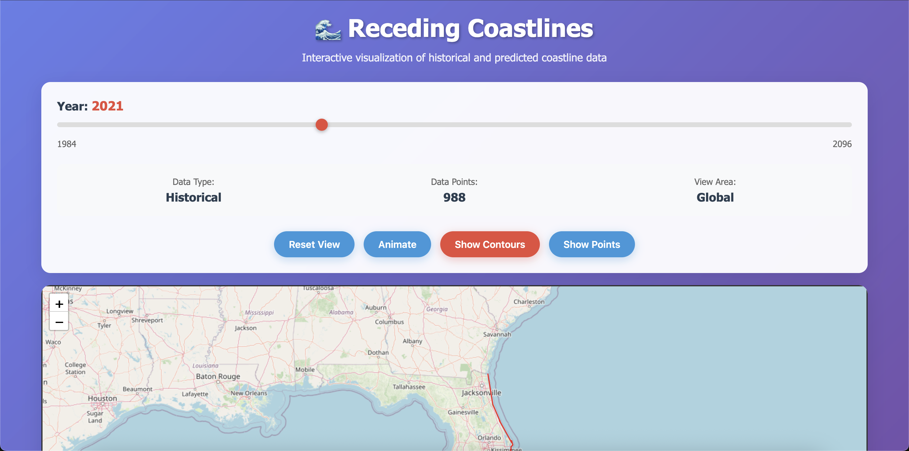
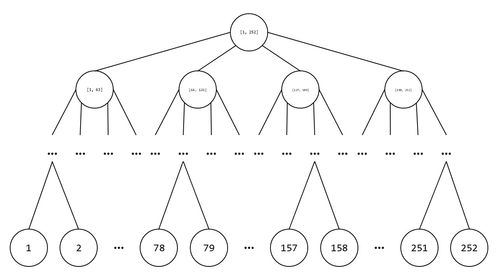
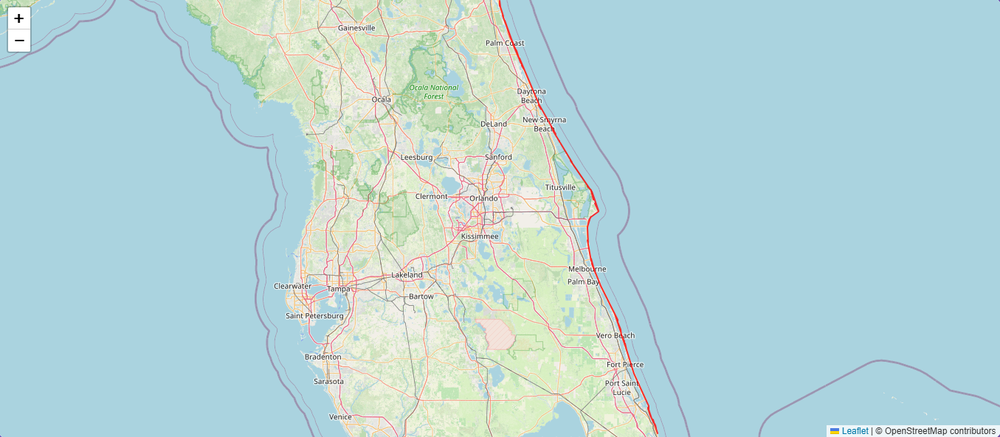
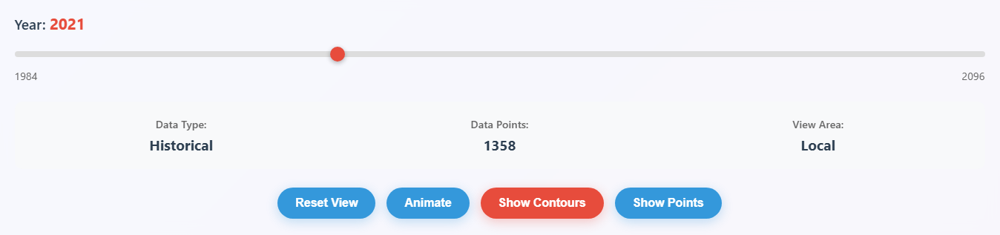

# 🌊 Receding Coastlines

Receding Coastlines allows you to visualize what Florida's eastern coast has looked like from 1984 to now, and what our transformer model predicts it will look like in the decades to come.

[Watch the demo!](https://youtu.be/YqlmWCwJer4?si=r1VoGgXS7s5L_Y5l)



## Running the Platform

### Prerequisites

Receding Coastlines makes heavy use of the [`uv`](https://github.com/astral-sh/uv) package manager, and you'll need to have it installed to run many of its software components. You can find installation instructions [here](https://docs.astral.sh/uv/getting-started/installation/).

### Getting the Data

Receding Coastlines deals with (1) historical and (2) future data. The historical data is from ['Satellite-derived shorelines for the U.S. Atlantic coast (1984-2021)'](https://data.usgs.gov/datacatalog/data/USGS:124b402e-dd8c-4e45-ac50-10ce6c8a083a) from the [Science Data Catalog](https://data.usgs.gov/datacatalog/) provided by the [U.S. Geological Survey](https://www.usgs.gov/). You will need to run the ETL pipeline to use this data with the platform. The future data is produced by our [transformer](transformer/) trained on this data. For the sake of convenience, [output of the model for 2022-2096](backend/data/future/coastline_yearly_changes.csv) has been transformed into an easily ingestable format and placed in the backend's data directory.

#### Getting Historical Data

Navigate to the [`etl_pipeline`](etl_pipeline/) directory and run the ETL pipeline with the following command:

```
uv run etl.py
```

Once this script is finished running, the `etl_pipeline` directory should now have a subdirectory named `segment_gdfs`, with `.gpkg` files. Each of these files is a [`GeoDataFrame`](https://geopandas.org/en/stable/docs/reference/api/geopandas.GeoDataFrame.html) containing data for how a segment of Florida's eastern coastline has changed from 1948-2021.

Move the `etl_pipeline/segment_gdfs` directory to the `backend/data` directory, and rename `backend/data/segment_gdfs` to `backend/data/historical`. With this, we should have everything we need to run the platform.

### Starting the Backend

Navigate to the [`backend`](backend/) directory and start the backend with the following command:

```
uv run main.py
```

This should start up the backend on port 5001.

### Starting the Frontend

Navigate to the [`web`](web/) directory and start the frontend with the following command:

```
uv run app.py
```

This should start up the frontend on port 5000.

**NOTE:** If you are running Receding Coastlines on macOS, the AirPlay Receiver may be running on port 5000. You can find instructions to disable it [here](https://discussions.apple.com/thread/254343678?answerId=258145653022).

### ~Fin~

Assuming all goes well, you should be able to navigate to [`http://localhost:5000`](http://localhost:5000) and see Receding Coastlines running:


## How It Works

### [ETL Pipeline](etl_pipeline/etl.py)

*Author: [Joshua Sheldon](https://www.linkedin.com/in/joshua-sheldon-6839aa1b2/)*

For our purposes, each entry in the historical data consists of two primary attributes: (1) a timestamp and (2) one or more lines, with vertices expressed in latitude and longitude, describing the shape of a section of Florida's coastline. However, while the data does have numbered sections, to the best of my knowledge, the data does not conform to consistent sections of the coastline. While it's possible there was an underlying pattern, I opted to not expend much time beyond initial checks in trying to find it. Rather, I implemented a segmentation scheme on top of the data.

Coastline updates (which you can think of as lines) are binned according to the latitudinal (north-south) centroid of their vertices. Each bin spans 0.02 degrees of latitude, meaning Florida's coastline is split into ~250 segments. I started with 0.01 degrees of latitude, but this made the shape of the coastline very erratic, prompting the change. Additionally, I didn't want to go much higher, because each segment corresponds to one sequence to train the model on, and I didn't want to shrink our training data any more than was necessary.

> Earlier I noted that each entry consists of *one or more lines*. The multiple lines case ended up proving problematic in transformer training and visual clarity, because these lines could be extremely short and far apart from one another, meaning that some segments at some timestamps appeared empty. Therefore, in the ETL pipeline, if a segment at a timestamp has multiple lines, I stitch all of the lines together, connecting the southmost point of the northmost line to the northmost point of the next northmost line, so on and so forth until all of the lines in the segment form one contiguous line. This drastically improved the coherence of our data.

For each timestamp in the dataset, I assemble one full coastline. The full coastline consists of any segments updated at that timestamp, and if a segment is not updated at that timestamp, it its line from the previous timestamp. While typically, multiple segments are updated at each timestamp, from my recollection, usually less than 10 segments are updated per timestamp. This means our data has a high temporal fidelity, but the change from timestamp to timestamp is relatively minimal. This also means our dataset starts at the first timestamp where we've encountered an update for all ~250 segments, meaning our dataset actually starts much later than 1984, where the original dataset starts.

Such are the quandaries of working with real data.

### [Transformer](transformer/)

The model is a transformer encoder, it has 8 attention heads and 8 layers. it encorperated weight decay at 0.01 and dropout at 0.11. it was trained for 18 epochs with a learning rate of 0.0003 using MSE as its loss function. The feed forward dimensionality is 512.


*architecture of a transformer*

To train the transformer first the data is resampled to an adjustable interval, with the deployed model resampled to 30 day steps, then the data is windowed at a 12 step (approx yearly) window and the data is normalized and deltas for latitude and longitude are computed. 

The model uses positional encoding for time series. The model's architecture is flexible, allowing hyperparameters like the number of layers, model dimensions, and attention heads to be customized using arguments without modifying the program directly.

The script supports both normalized loss and loss measured in real-world units (meters), making it suitable for both research and practical geospatial forecasting. Logging and model checkpointing are provided for monitoring progress and saving the best models.

### [Backend](backend/)

*Author: [Joshua Sheldon](https://www.linkedin.com/in/joshua-sheldon-6839aa1b2/)*

Our data has a relatively high spatial and temporal fidelity. Our final, transformed historical data consists of 4,663 timestamps, and each full coastline has tens of thousands of vertices. Therefore, if the frontend was to be at all responsive, I had to be clever in the way I served the data to it.

The primary strategy I devised to optimize serving data was, for each timestamp, splitting the segments into a tree structure, like so:



Each node represents one or more segments. For instance, the root node represents the full coastline, segments 1-252. Each node has a maximum of four children, splitting its segments amongst its children. So, the children of the root node represent, from north to south, the first fourth of Florida's coastline, the second fourth of Florida's coastline, so on and so forth. This continues until the leaf nodes, which each represent a single segment.

When the backend starts, for every timestamp (past and future), it creates a [coastline tree](backend/src/coastline_tree.py), and computes the bounding box for each node's data. For instance, the bounding box of the root node covers the entirety of Florida's coastline. This data is stored [in a `dict`](backend/src/coastline_mgr.py) from year to coastline tree.

When the frontend wants to retrieve the coastline's shape for a specific year, it provides (1) the year it wants data for and (2) the latitude and longitude coordinates of the top left corner and bottom right corner of the user's view of the map.

> The original plan was for the frontend to provide data with even higher temporal fidelity than it already does, by using a `dict` from *timestamp* to coastline tree. The backend would create a sorted list of timestamps and receive a timestamp from the frontend. Then, the backend would search the sorted list to find the closest timestamp to the user's request, and use that tree. While this idea was scrapped due to time, you can still find its vestiges in the backend's code. While the idea is cool from a technical perspective, realistically, sub-year temporal fidelity probably wouldn't have added much value to the user experience.

Firstly, the backend retrieves the appropriate tree for the provided year. Then, it compares the user's view to the bounding box of the root node. If the root node's bounding box is completely within the user's view, then the root node is returned. If that's not the case, the backend descends to the root node's children, searching for the node with the bounding box that best fits the user's view.

When the candidate node is identified, [an object](backend/src/coastline.py) is created from the node with segment shape data. If the node represents a single segment, the object simply converts the line into a format friendly for JSON serialization. However, if the node represents multiple segments, this object stitches together all the node's segments into a single line, then calls [`shapely`](https://shapely.readthedocs.io/en/stable/)'s [`simplify`](https://shapely.readthedocs.io/en/2.0.7/reference/shapely.simplify.html) method on the line, drastically reducing the number of vertices in the line.

Finally, the backend serializes the object's data into JSON and returns the vertices of the node's line to the user.

This approach enables the backend to serve data incredibly quickly, with backend response times frequently being less than 10 ms.

It's critical to note that this approach was heavily inspired by [Stripe](https://stripe.com/)'s tax jurisdiction resolution system, which you can read about [here](https://stripe.com/blog/how-we-built-it-jurisdiction-resolution-for-stripe-tax).

### [Frontend](web/)

*Coming soon...*
The frontend works by rendering a map using a Leaflet map UI and then drawing over the map with the data points in blue color (disabled by default) and the connecting them with a red line to display the coastline for the current year. 


You can also zoom into the map to see a better view of an area, not all the data is being loaded at the same time, so when you zoom in a bounding box works to only display the data that is needed for the specific region that you are looking at.


Above the map you can find a few buttons that have different functionalities, as well as seeing what the current year for the map is.


<!-- CONTACT -->
### Contact

Yash Jani - [![LinkedIn][linkedin-shield]][linkedin-url-yash] - yashjani144@gmail.com

Joshua Sheldon - [![LinkedIn][linkedin-shield]][linkedin-url-yash] - admin@joshuasheldon.me

Khurram Valiyev- [![LinkedIn][linkedin-shield]][linkedin-url-yash] - khurram@valiyev.tech

Evan Gunderson - [![LinkedIn][linkedin-shield]][linkedin-url-yash] - yashjani144@gmail.com

[linkedin-shield]: https://img.shields.io/badge/-LinkedIn-0A66C2.svg?style=for-the-badge&logo=linkedin&logoColor=white
[linkedin-url-yash]: https://linkedin.com/in/yash-jani-8245bb26a/
[linkedin-url-yash]: https://www.linkedin.com/in/joshua-sheldon-6839aa1b2/
[linkedin-url-khurram]: https://www.linkedin.com/in/khurram-valiyev/
[linkedin-url-evan]: https://www.linkedin.com/in/egunderson2004/
